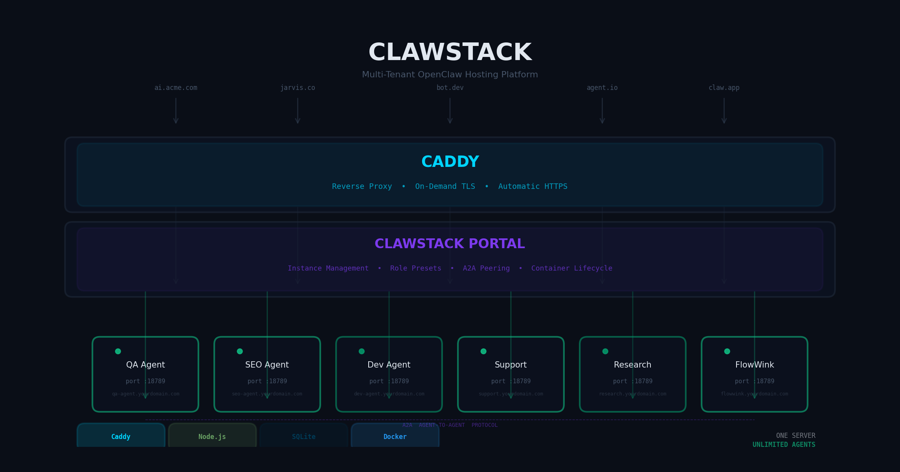

# ClawClass

> **Spin up OpenClaw agents. Train them. Connect them to business.**

[](LICENSE)
[](https://github.com/magnusfroste/clawclass/issues)
[](https://github.com/magnusfroste/clawclass/discussions)
[](#contributing)

<p align="center">
  
</p>

[OpenClaw](https://openclaw.dev) gives you a persistent AI agent. **ClawClass** is where you spin up, train, and connect them — fast.

One server. Unlimited agents. Each with its own domain, HTTPS, and role preset.

## Quick Start

```bash
git clone https://github.com/magnusfroste/clawclass.git
cd clawclass
cp .env.example .env
docker compose up -d
```

Open `https://clawclass.yourdomain.com` — create your first agent in 30 seconds.

## What You Get

| Feature | What it means |
|---------|--------------|
| **Instant HTTPS** | Caddy issues TLS certificates on first request — no config needed |
| **Role presets** | Pick a role (QA, SEO, Dev, Support, Research, FlowWink operator) — the agent boots ready to work |
| **Multi-tenant isolation** | Each agent gets its own domain, container, and memory — fully isolated |
| **A2A peering** | Enable agent-to-agent communication with one checkbox |
| **Browser terminal** | Exec into any agent container from the portal UI |

## Connect to FlowWink

The `flowwink` role preset turns an OpenClaw agent into an **autonomous Business Operating System operator**. Connect it via MCP and it runs your SaaS on autopilot:

- **250+ skills** across CMS, CRM, and ERP — quotes, invoices, contracts, expenses, support, content, analytics
- **4-hour heartbeat** — wakes up, audits the pipeline, catches stuck orders, flags compliance issues, reports findings
- **No human in the loop** unless something critical surfaces

FlowWink is open source: [github.com/magnusfroste/flowwink](https://github.com/magnusfroste/flowwink)

## How It Works

```
Your domain → Caddy (on-demand TLS) → ClawClass portal → OpenClaw container
                                            ↓
                              FlowWink MCP (250+ business skills)
```

## Agent Roles

| Role | Purpose | Heartbeat |
|------|---------|-----------|
| `generalist` | Blank slate — full control | — |
| `qa` | Audit URLs, forms, accessibility | 12h |
| `seo` | SEO audits, keyword analysis, content gaps | 24h |
| `dev` | Code review, documentation, security scanning | — |
| `support` | Customer-facing help and escalation | 2h |
| `research` | Web research, analysis, synthesis | — |
| `flowwink` | Autonomous BOS operator | 4h |

## Tech Stack

- **Caddy** — reverse proxy, automatic HTTPS
- **ClawClass portal** — Node.js, SQLite, Dockerode
- **OpenClaw** — official image from ghcr.io/openclaw/openclaw
- **A2A gateway** — optional plugin for agent-to-agent communication

See [docs/](docs/) for deep dives on A2A, storage, and dual-channel communication.

## Contributing

ClawClass is open source and community-driven. We want it to become *the* Docker stack for OpenClaw.

- **Report bugs** → [Open an issue](https://github.com/magnusfroste/clawclass/issues)
- **Request features** → [Start a discussion](https://github.com/magnusfroste/clawclass/discussions)
- **Contribute** → Fork → branch → test → PR

## License

MIT

*Built by [Magnus Froste](https://www.froste.eu).*
